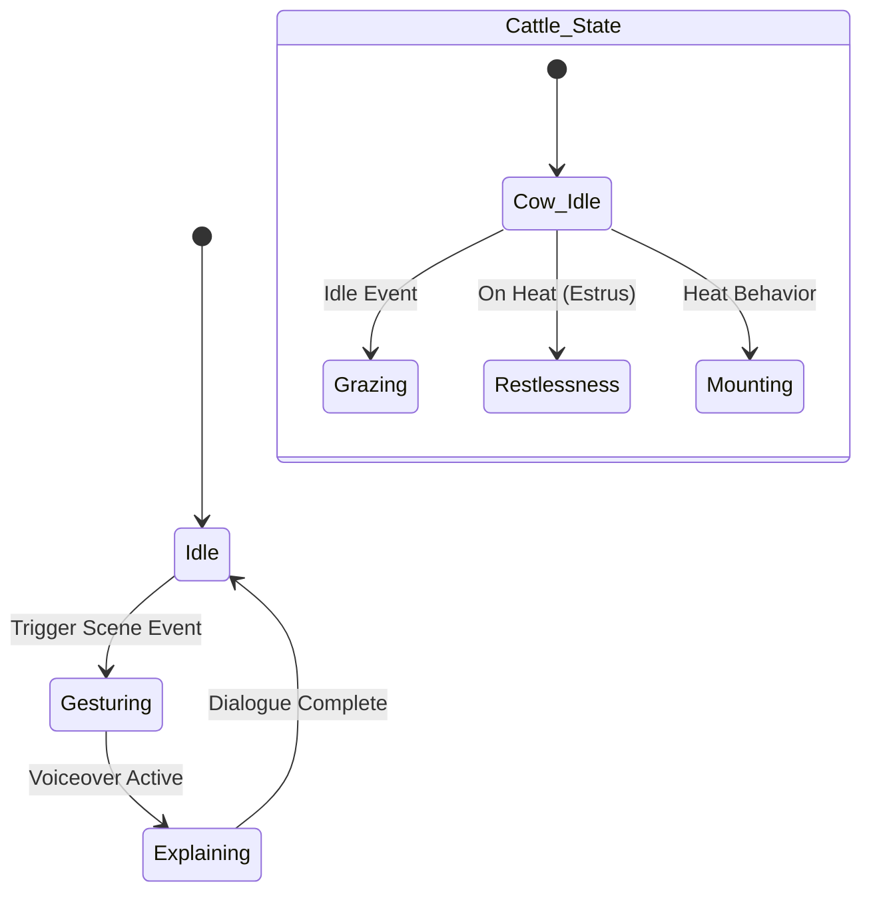
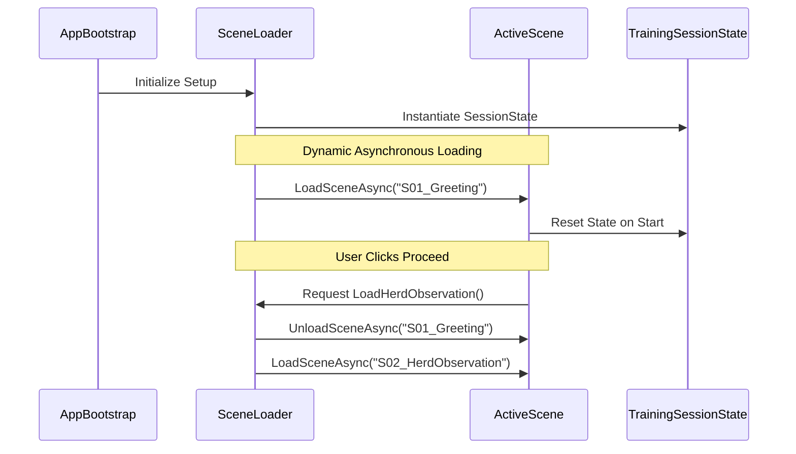
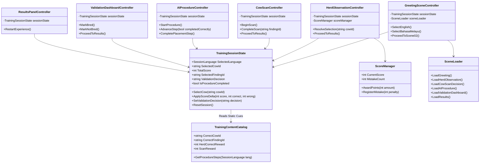

# SOFTWARE DESIGN SPECIFICATION (SDS)
## VR Smart Ruminant Breeding Lab Training Experience
**Project Name:** VR: Smart Ruminant Breeding Lab  
**Client:** Department of Veterinary Services Malaysia (Veterinar Malaysia)  
**Vendor:** EEE LAB VISUAL (002278324-V)  
**Date:** June 2026  
**Document Version:** 1.0  
**Status:** Under Review  

---

## 1. Spatial Asset Specification (The Approval Gate)

This section establishes the technical limits, performance budgets, and behavioral definitions for all visual components of the VR training experience to ensure 72+ FPS performance on standalone Meta Quest 3/3S.

### 1.1 Environment Asset Sheets

To maintain fluid rendering, environment meshes are categorized with strict triangle/vertex limits. All environments utilize low-draw-call, highly-optimized low-poly models styled harmoniously with modern clinical-agricultural accents.

| Environment / Scene | Description & Prefabs | Scale Mapping | Polycount Budget | LOD Strategy |
| :--- | :--- | :--- | :--- | :--- |
| **S01: Farm Courtyard** | Modern gateway arch, fencing, lush grass ground plane, entry signboard. | 25m x 25m boundary | Max 45,000 triangles | LOD0 (100% detail), LOD1 (50% detail for background assets at >15m). |
| **S02: Paddock Pasture** | Open field, paddock fences, watering troughs, distant trees. | 50m x 50m grazing area | Max 60,000 triangles | LOD0 (100%), LOD1 (40% mesh simplification for distance foliage & fences). |
| **S03 & S04: Breeding Stall** | Breeding chute, metal safety rails, clinical tool table, sterile lights. | 8m x 8m enclosed zone | Max 35,000 triangles | LOD0 only (static close-up environment, high fidelity needed). |
| **S05 & S06: Control Hub** | Modern industrial office space, computer desk, terminal cabinet, server racks. | 12m x 12m interior area | Max 30,000 triangles | LOD0 only (fully enclosed indoor scene with static lightmaps). |

---

### 1.2 3D Asset Library (Static & Interactive Props)

All interactive and static props are optimized for standalone mobile VR. Textures are budgeted at a maximum of 2K (2048x2048) PBR maps, compressed using ASTC 6x6 or 8x8 formats.

| Asset ID | Class / Name | Description | Polycount | Texture Resolution & Budget | Collider Config |
| :--- | :--- | :--- | :--- | :--- | :--- |
| **PRP-CH-01** | Cattle Squeeze Chute | Metal crush cage to safely position and hold the dairy cow for AI. | 4,200 tris | 2048x2048 Albedo/Metallic/Normal (PBR) | Box Colliders on frame rails |
| **PRP-SC-02** | Smart Scanner | Holographic handheld scanner showing temperature and follicle charts. | 1,800 tris | 1024x1024 Albedo/Emission/Normal | Sphere Collider on grab handle |
| **PRP-GUN-03** | AI Insemination Gun | Virtual instrument used to deliver genetic doses. | 1,100 tris | 1024x1024 Albedo/Metallic/Normal | Capsule Collider on shaft |
| **PRP-TR-04** | Medical Utility Trolley | wheeled tray holding the AI gun and semen straws. | 1,500 tris | 2048x2048 Albedo/Metallic/Normal | Mesh Colliders on trays (convex) |
| **PRP-COW-01** | Dairy Cow (Hero Model) | Realistic Holstein cow model with visible physiological detail. | 12,500 tris | 2048x2048 Albedo/Normal/Roughness | Compound Capsule & Box Colliders |

---

### 1.3 Rigging & Avatar Animation States

Visual representations of characters and cattle must be anatomically and behaviorally accurate to guide learning outcomes. 



#### A. Guide Avatar Animation States
The Guide Avatar utilizes a humanoid rig (22 bones).
* **AVS-IDLE (Idle):** Default resting state. Breathing motion with subtle shifts.
* **AVS-WAVE (Greeting):** Prompted at S01 entrance. Hand wave gesturing to welcome the user.
* **AVS-EXPLAIN (Instructional):** Triggered during active audio play. Synced lip-flaps, arm gestures pointing to UI panels, and posture adjustments.
* **AVS-SUCCESS (Celebration):** Triggered at S06 score. Friendly clapping and nodding.

#### B. Cattle Animation States
The realistic Cow model features a quad quadruped rig (42 bones) to showcase key diagnostic signs of estrus.
* **COW-IDLE (Idling):** Normal tail swishing, chewing cud, breathing.
* **COW-GRAZING (Feeding):** Head lowered to the ground plane, chewing.
* **COW-RESTLESS (Restlessness):** Pacing back and forth, tail twitching, ear movements indicating discomfort.
* **COW-MOUNTING (Standing Heat):** Standing rigid when approached (Standing Heat), or climbing/mounting another cow model to signal active estrus.

---

## 2. Software & Architecture Design

### 2.1 Unity Scene Management & Memory Flow

To maintain frame rates on Meta Quest standalone devices, additive scene loading and garbage collection management are implemented.



1. **Bootstrap Scene (`S00_XRSmokeTest`):** Runs first. Allocates persistent Singletons (`TrainingSessionState` and `ScoreManager`).
2. **Asynchronous Load Pipeline:** Scene switches use `SceneManager.LoadSceneAsync` with background threads.
3. **Asset Unloading:** Before a new scene loads, `Resources.UnloadUnusedAssets` is invoked. This cleans the texture and mesh heap, preventing memory leaks.
4. **Garbage Collection (GC) Lock:** Native GC is monitored. Heavy memory allocations are restricted to scene transitions to prevent micro-stutters during VR gameplay.

---

### 2.2 Component Diagram

The application leverages a modular MVC-style architecture. ScriptableObjects manage static content, MonoBehaviours handle scene logic, and the persistent state acts as a single source of truth.



* **Core State Manager:** [TrainingSessionState.cs](file:///Users/fihiromar/Desktop/WORKS/20260416_VETERINARVR/WIP/Veterinar_VR/Assets/_Project/VeterinarVR/Scripts/Core/TrainingSessionState.cs) is a persistent component that lives across all scenes to aggregate results.
* **Scene Transition Manager:** [SceneLoader.cs](file:///Users/fihiromar/Desktop/WORKS/20260416_VETERINARVR/WIP/Veterinar_VR/Assets/_Project/VeterinarVR/Scripts/Core/SceneLoader.cs) wraps Unity SceneManager functions asynchronously.
* **Bilingual Display System:** [LocalizedText.cs](file:///Users/fihiromar/Desktop/WORKS/20260416_VETERINARVR/WIP/Veterinar_VR/Assets/_Project/VeterinarVR/Scripts/UI/LocalizedText.cs) queries language selections and displays matching dictionaries.

---

### 2.3 XR Rig Configuration & Physics Grabbing

The VR interaction pipeline uses the **Unity XR Interaction Toolkit (XRI)** paired with **AutoHand** for natural hand physics.

#### A. XR Origin Settings
* **Tracking Origin Mode:** Floor-Level (Meta Quest boundary coordinates mapped to VR height).
* **Camera Offset:** 1.36m (adjustable offset for sitting vs. standing training).
* **Interactors:** Left and right controller anchors hold an `XRRayInteractor` for UI selections and an `XRDirectInteractor` for direct physics grabbing.

#### B. Physics Grabbing Constraints
To avoid tracking offsets and hand jitter:
* **Grab Mode:** Velocity-Based (the grabbed item is moved via physical forces to resolve collisions, preventing it from clipping through the cow's mesh or clinical tables).
* **Instantaneous Snap:** Used only for attaching the semen straw to the AI gun barrel, locked to specific snap sockets.
* **Controller Haptics:** Controller vibration impulses (Frequency: 0.5, Duration: 0.15s) trigger when hand colliders intersect grab points (e.g., the AI gun handle).

---

## 3. Data & Interface Design

### 3.1 Database Schema Execution

The system generates local session outputs for tracking student performance and logging spatial alignment faults. This maps data schemas to local JSON configurations and SQLite tables for MAHA 2026 leaderboard synchronization.

#### A. RUN_SESSION_LOG (Session Performance Tracking)
Stores the details of each training iteration completed by operators.

```sql
CREATE TABLE RUN_SESSION_LOG (
    session_id TEXT PRIMARY KEY,
    timestamp TEXT NOT NULL,
    operator_name TEXT DEFAULT 'Visitor',
    language_selected TEXT CHECK(language_selected IN ('English', 'BahasaMelayu')),
    selected_cow_id TEXT NOT NULL,
    correct_cow_selected INTEGER CHECK(correct_cow_selected IN (0, 1)),
    detected_finding_id TEXT,
    correct_finding_selected INTEGER CHECK(correct_finding_selected IN (0, 1)),
    procedure_completed INTEGER CHECK(procedure_completed IN (0, 1)),
    procedure_completed_steps INTEGER,
    validation_decision TEXT CHECK(validation_decision IN ('Bred', 'Not Bred')),
    final_score INTEGER NOT NULL,
    star_rating INTEGER NOT NULL,
    badge_earned TEXT NOT NULL
);
```

#### B. SPATIAL_ERROR_LOG (Diagnostics and Alignment Analytics)
Logs spatial interaction errors during procedures (e.g., failing to place tools in highlight regions).

```sql
CREATE TABLE SPATIAL_ERROR_LOG (
    log_id INTEGER PRIMARY KEY AUTOINCREMENT,
    session_id TEXT NOT NULL,
    timestamp TEXT NOT NULL,
    scene_name TEXT NOT NULL,
    interaction_type TEXT NOT NULL, -- e.g., 'Grab', 'Insertion', 'Raycast'
    target_object_id TEXT NOT NULL,  -- e.g., 'AI_Gun_Socket', 'Cow_B_Hotspot'
    error_distance REAL,            -- Distance offset in meters (for insertion alignment)
    time_elapsed REAL,              -- Seconds since scene load
    error_details TEXT,             -- Message string (e.g., 'AI Gun out of placement bounds')
    FOREIGN KEY (session_id) REFERENCES RUN_SESSION_LOG(session_id)
);
```

#### C. Local JSON Schema Serialization (Offline Cache)
For offline operations on Meta Quest standalone devices, logs are cached as local JSON schemas before DB syncing.

```json
{
  "$schema": "https://json-schema.org/draft/2020-12/schema",
  "title": "RunSessionLog",
  "type": "object",
  "properties": {
    "sessionId": { "type": "string" },
    "timestamp": { "type": "string", "format": "date-time" },
    "selectedLanguage": { "type": "string", "enum": ["English", "BahasaMelayu"] },
    "finalScore": { "type": "integer" },
    "metrics": {
      "type": "object",
      "properties": {
        "correctCount": { "type": "integer" },
        "wrongCount": { "type": "integer" },
        "completionTimeSeconds": { "type": "number" }
      },
      "required": ["correctCount", "wrongCount", "completionTimeSeconds"]
    }
  },
  "required": ["sessionId", "timestamp", "selectedLanguage", "finalScore", "metrics"]
}
```

---

### 3.2 UI/UX Style Guide & Spatial Comfort

To prevent simulation sickness and improve interaction accessibility, UI elements follow comfortable stereoscopic layout patterns.

```
       [USER'S VIEWPORT FIELD OF VIEW]
       
                   [Forward View]
                         |
      <- 30° Left                  30° Right ->
     [Timer Panel]  [MCQ Interactive Panel]  [Guide Box]
                         |
                         |
                1.5m to 2.2m Distance
                         |
                    [XR Origin]
```

* **Spatial Positioning:**
  * Interactive UI panels are placed in **World Space**.
  * Canvas distance is restricted to **1.5m to 2.2m** from the player.
  * Pitch height sits within **1.1m to 1.6m** (eye level).
* **Comfort Zones:**
  * Screen positioning is limited to a **60° horizontal cone** directly in front of the player (30° left/right offsets). This eliminates excessive neck turning.
  * Canvas elements are locked statically relative to the world coordinate system, rather than parented directly to the camera view (head-locked UI), preventing nausea.
* **Color Palette (Modern Agricultural Lab):**
  * Primary Accent: Deep Forest Green (`#1E3F20`) — represents veterinary branding.
  * Secondary Contrast: Clean White (`#F5F5F5`) — ensures readable, high-contrast text.
  * Interactive Elements: Muted Emerald (`#2E7D32`) for active selections; Warning Yellow (`#FBC02D`) for highlights and alerts.
* **Typography:** TextMesh Pro utilizing **Outfit** or **Inter** fonts, styled with minimum font sizing of 32pt at 2m depth to ensure clear readability.
