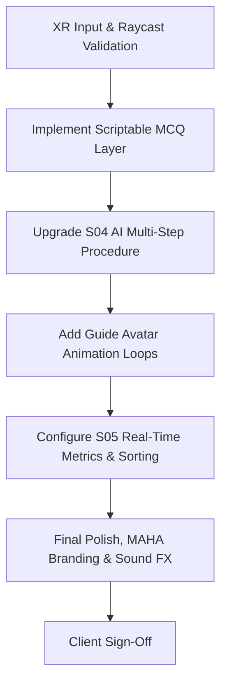

# USER REQUIREMENT SPECIFICATION (URS)
## VR Smart Ruminant Breeding Lab Training Experience
**Project Name:** VR: Smart Ruminant Breeding Lab  
**Client:** Department of Veterinary Services Malaysia (Veterinar Malaysia)  
**Vendor:** EEE LAB VISUAL (002278324-V)  
**Date:** June 2026  
**Document Version:** 1.0  
**Status:** Under Review  

---

## 1. Document Control

| Version | Date | Author | Reviewer | Description |
| :--- | :--- | :--- | :--- | :--- |
| 1.0 | 2026-06-25 | EEE LAB Dev Team | fihiromar | Initial release of User Requirement Specification (URS). |

---

## 2. Project Overview

### 2.1 Background
The Department of Veterinary Services Malaysia (Veterinar Malaysia) requires a state-of-the-art virtual reality (VR) training application to showcase at **MAHA 2026**. The experience, titled the **Smart Ruminant Breeding Lab**, aims to educate veterinary students, farmers, and the general public on advanced ruminant breeding technologies and artificial insemination (AI) procedures. The simulation replicates standard Malaysian veterinary guidelines in an engaging, gamified VR environment.

### 2.2 Objective
To design and develop a six-scene VR training experience optimized for standalone **Meta Quest 3 / 3S** headsets, allowing users to:
1. Learn and identify clinical signs of estrus (heat) in cattle.
2. Interactively scan cows to inspect diagnostic markers (body temperature, follicle size, cervical mucus).
3. Perform a step-by-step artificial insemination (AI) procedure using spatial controllers.
4. Review training performance and genetic record management via a validation dashboard.
5. Receive gamified scoring, performance feedback, and badges based on their diagnostics accuracy and execution.

### 2.3 Target Hardware
* **Primary Headset:** Meta Quest 3 or Meta Quest 3S (128GB Bundle).
* **Tracking:** 6-DOF inside-out spatial tracking using Touch Plus controllers.
* **Spectator Mirroring:** Low-latency Wi-Fi local casting from headsets to a dual 40-inch Commercial Smart Display array.
* **Booth Infrastructure:** 10' x 10' booth divided into dual safety interaction zones, equipped with circular anti-slip safety mats and a centralized charging/docking station.

---

## 3. Functional Requirements (Scene-by-Scene Spec)

### Scene 01: Greeting (`S01_Greeting.unity`)
* **Objective:** Welcome the user and capture language preference.
* **Setting:** High-tech modern farm entrance with lush green pastures.
* **Narrator:** A static/animated Guide Avatar appears to guide the user.
* **Core Logic:**
  * User selects preferred language: **Bahasa Melayu** or **English**.
  * Audio narration and subtitles dynamically update based on the selection.
  * The Guide Avatar welcomes the user and explains the simulation's learning goals.
  * A simple introductory breeding question is presented to test user readiness.
  * A "Proceed" button becomes active once language and introduction are resolved.
* **Controller Script:** [GreetingSceneController.cs](file:///Users/fihiromar/Desktop/WORKS/20260416_VETERINARVR/WIP/Veterinar_VR/Assets/_Project/VeterinarVR/Scripts/UI/GreetingSceneController.cs)

### Scene 02: Herd Behavior Observation (`S02_HerdObservation.unity`)
* **Objective:** Identify the cow displaying active signs of estrus (heat).
* **Setting:** Open grazing paddock with fences, watering troughs, and distant trees.
* **Core Logic:**
  * User observes multiple cattle displaying different behaviors: grazing, walking, and mounting.
  * The user must identify and select the cow showing active estrus signs (e.g., Standing Heat, Mounting Behaviour, Restlessness).
  * Selection is performed by pointing with the XR Ray Interactor and triggering.
  * If the correct cow is chosen (Cow B), points are awarded. Incorrect selections incur a small penalty.
  * The Guide Avatar narrates why recognizing these behavioral markers is critical for breeding.
  * A "Proceed" button is enabled once a selection is registered.
* **Controller Script:** [HerdObservationController.cs](file:///Users/fihiromar/Desktop/WORKS/20260416_VETERINARVR/WIP/Veterinar_VR/Assets/_Project/VeterinarVR/Scripts/Gameplay/HerdObservationController.cs)

### Scene 03: Cow Scan Decision (`S03_CowScanDecision.unity`)
* **Objective:** Inspect the chosen cow and decide if she is in the 24-hour breeding window.
* **Setting:** Indoor veterinary sorting chute / squeeze crush.
* **Core Logic:**
  * The user performs a physical inspection of the cow's hindquarters (vulva swelling and cervical mucus discharge).
  * The user triggers a holographic "Smart Scanner" tool to analyze physiological metrics:
    * Body Temperature: 38.5°C
    * Follicle development status
  * A Multiple Choice Question (MCQ) overlay is displayed. The user must analyze the follicle size and temperature data to decide if the cow is in the optimal 24-hour ovulation window.
  * Point allocation based on correct diagnostic determination.
* **Controller Script:** [CowScanController.cs](file:///Users/fihiromar/Desktop/WORKS/20260416_VETERINARVR/WIP/Veterinar_VR/Assets/_Project/VeterinarVR/Scripts/Gameplay/CowScanController.cs)

### Scene 04: Artificial Insemination (AI) Procedure (`S04_AIProcedure.unity`)
* **Objective:** Perform the artificial insemination sequence accurately.
* **Setting:** Sterile clinical breeding stall.
* **Core Logic:**
  * The user selects the genetic material: **Semen Lembu Daging** (Beef) or **Semen Lembu Susu** (Dairy).
  * The user picks up the AI Gun instrument from a sterile tray (utilizing Autohand/XR Grab physics).
  * The user inserts the gun into the correct highlighted injection area on the cow.
  * The system validates placement using collision logic (`AIProcedurePlacementZone.cs`).
  * Once the gun is correctly placed, the user triggers the final delivery mechanism ("Deliver Dose") to complete the procedure.
* **Controller Script:** [AIProcedureController.cs](file:///Users/fihiromar/Desktop/WORKS/20260416_VETERINARVR/WIP/Veterinar_VR/Assets/_Project/VeterinarVR/Scripts/Gameplay/AIProcedureController.cs)

### Scene 05: Validation Dashboard (`S05_ValidationDashboard.unity`)
* **Objective:** Review breeding metrics and validate genetic record keeping.
* **Setting:** Control room panel with floating data screens.
* **Core Logic:**
  * A Data Analytics Dashboard presents session stats: accuracy (Ketepatan), execution time (Masa Pelaksanaan), and mistakes.
  * The user must answer validation questions regarding optimal genetic traits and record management.
  * The user sorts breeding outcomes: classifying cows as "Bred" (Bunting) or "Not Bred" (Tidak Bunting).
  * Emphasizes the importance of electronic records in smart ruminant farming.
* **Controller Script:** [ValidationDashboardController.cs](file:///Users/fihiromar/Desktop/WORKS/20260416_VETERINARVR/WIP/Veterinar_VR/Assets/_Project/VeterinarVR/Scripts/UI/ValidationDashboardController.cs)

### Scene 06: Results Scoreboard (`S06_ResultsScoreboard.unity`)
* **Objective:** Present the final performance assessment and celebrate completion.
* **Setting:** Celebratory podium overlooking the smart farm with MAHA 2026 branding.
* **Core Logic:**
  * Displays total accumulated score, correct selections count, and wrong selections count.
  * Awards a star rating (1 to 5 stars) and a digital badge (Gold, Silver, Bronze) based on performance.
  * The Guide Avatar congratulates the user and delivers a customized recommendation for further practice.
  * Displays options to "Restart" or "Exit".
* **Controller Script:** [ResultsPanelController.cs](file:///Users/fihiromar/Desktop/WORKS/20260416_VETERINARVR/WIP/Veterinar_VR/Assets/_Project/VeterinarVR/Scripts/UI/ResultsPanelController.cs)

---

## 4. Non-Functional Requirements

### 4.1 Localization & Language
* Full support for bilingual operation: **English** and **Bahasa Melayu**.
* Systems must load text and audio clips dynamically based on the language state managed in [TrainingSessionState.cs](file:///Users/fihiromar/Desktop/WORKS/20260416_VETERINARVR/WIP/Veterinar_VR/Assets/_Project/VeterinarVR/Scripts/Core/TrainingSessionState.cs).

### 4.2 Visuals & Aesthetics
* Built on the **Universal Render Pipeline (URP)** in Unity.
* Implements high-quality shaders, custom selection highlights, and holographic scan particle systems.
* Seamless skybox and lighting setups to mimic outdoor Malaysian farm atmospheres.

### 4.3 Audio
* Voiceover (VO) narration scripts in English and Bahasa Melayu for the Guide Avatar (6 distinct clips corresponding to scenes).
* Ambient spatialized background audio (birds, low farm wind, distant cows).
* Feedback SFX: Success chimes (correct actions) and error buzzers (incorrect choices).

### 4.4 Technical State Management
* Persistent data stored throughout the training run is overseen by [TrainingSessionState.cs](file:///Users/fihiromar/Desktop/WORKS/20260416_VETERINARVR/WIP/Veterinar_VR/Assets/_Project/VeterinarVR/Scripts/Core/TrainingSessionState.cs).
* Configurable rewards, penalties, and textual cues are referenced from a centralized ScriptableObject asset managed by [TrainingContentCatalog.cs](file:///Users/fihiromar/Desktop/WORKS/20260416_VETERINARVR/WIP/Veterinar_VR/Assets/_Project/VeterinarVR/Scripts/Data/TrainingContentCatalog.cs).

---

## 5. Development Status & Gap Analysis

To ensure transparent reporting, the project’s codebase has been audited. Below is the alignment between the target user requirements and the current implementation state.

### 5.1 What is Fully Implemented
1. **Scene Infrastructure:** All scene files (`S00` to `S06`) are created and wired into the build.
2. **State & Scene Navigation:** Single-instance managers for loading, state tracking, and points accumulation are fully operational ([TrainingSessionState.cs](file:///Users/fihiromar/Desktop/WORKS/20260416_VETERINARVR/WIP/Veterinar_VR/Assets/_Project/VeterinarVR/Scripts/Core/TrainingSessionState.cs), [ScoreManager.cs](file:///Users/fihiromar/Desktop/WORKS/20260416_VETERINARVR/WIP/Veterinar_VR/Assets/_Project/VeterinarVR/Scripts/Core/ScoreManager.cs), [SceneLoader.cs](file:///Users/fihiromar/Desktop/WORKS/20260416_VETERINARVR/WIP/Veterinar_VR/Assets/_Project/VeterinarVR/Scripts/Core/SceneLoader.cs)).
3. **Bilingual Text Architecture:** Layout texts and UI labels use translation dictionaries to display either English or Bahasa Melayu text depending on user preference ([LocalizedText.cs](file:///Users/fihiromar/Desktop/WORKS/20260416_VETERINARVR/WIP/Veterinar_VR/Assets/_Project/VeterinarVR/Scripts/UI/LocalizedText.cs)).
4. **Scene Controllers:** Initial UI controllers handle scene loading and baseline clicks for S01, S02, S03, S04, S05, and S06.
5. **Assets Integration:** Core assets, low-poly environmental meshes, realistic cow models, and spatial audio resources are present in the asset database.
6. **Avatar Assets:** Guide avatar GLB models have been converted to Unity-compatible FBX configurations and prepared for guide placement.

### 5.2 Current Gaps & Roadblocks (Where We Are Now)
1. **Scenario MCQs (S03 & S05):** The multiple-choice questions (e.g., verifying the 24-hour heat window in Scene 3, and validating genetic records in Scene 5) currently use hardcoded placeholder buttons. The data-driven `QuestionData` script structures are not yet dynamically loaded into the scene canvases.
2. **AI Procedure Sequence (S04):** The AI gun procedure in Scene 4 currently functions as a simplified placement flow (grabbing the tool and inserting it). The full required flow (choosing semen genetic lines, loading the gun, and executing the insertion sequence) needs to be configured as distinct steps.
3. **Analytics Dashboard Calculations (S05):** The validation dashboard UI displays static templates. Code needs to be added to dynamically calculate and display execution time, accuracy rates, and error logs.
4. **Avatar Animations:** The imported guide avatar models are static. Custom animation loops (waving, talking, idling) need to be imported and wired into an Animator Controller to make the guide look natural.
5. **XR Native Validation:** While basic XR support and raycasting are implemented, full optimization and testing on physical Quest 3/3S hardware or through the XR simulator are needed to ensure visual alignment of overlays and raycasts in VR space.

---

## 6. Forward-Looking Roadmap (What's Next)

The immediate next steps for the engineering team are:

1. **Phase 1: VR Input and Overlay Polish**
   * Perform hardware testing using Quest 3/3S and Meta XR Simulator.
   * Fine-tune world-space UI positions, raycast interactions, and controller bindings.
2. **Phase 2: Data-Driven MCQ Integration**
   * Integrate [QuestionData.cs](file:///Users/fihiromar/Desktop/WORKS/20260416_VETERINARVR/WIP/Veterinar_VR/Assets/_Project/VeterinarVR/Scripts/Data/QuestionData.cs) and [CowData.cs](file:///Users/fihiromar/Desktop/WORKS/20260416_VETERINARVR/WIP/Veterinar_VR/Assets/_Project/VeterinarVR/Scripts/Data/CowData.cs) into Scene 3 and Scene 5.
   * Dynamically generate quiz buttons on the canvases based on the active cow's dataset.
3. **Phase 3: Multi-Step Procedure Logic (S04)**
   * Code the multi-step artificial insemination procedure:
     1. Semen Selection UI (Beef vs. Dairy).
     2. Physical loading mechanism (attaching semen straw to the AI gun).
     3. Spatial insertion zone detection with collision checking.
4. **Phase 4: Guide Avatar Animation Setup**
   * Import standard humanoid idle, wave, and speaking animations.
   * Set up an Animator Controller to trigger guide expressions based on scenario states.
5. **Phase 5: Real-Time Performance Analytics (S05)**
   * Implement session timer in `TrainingSessionState` to calculate execution time.
   * Feed accuracy stats and error details to the floating data screens in Scene 5.
6. **Phase 6: Audio Polish & MAHA 2026 Branding**
   * Integrate the bilingual voiceover files.
   * Apply MAHA 2026 banners and visual elements to the environment in Scene 6.
